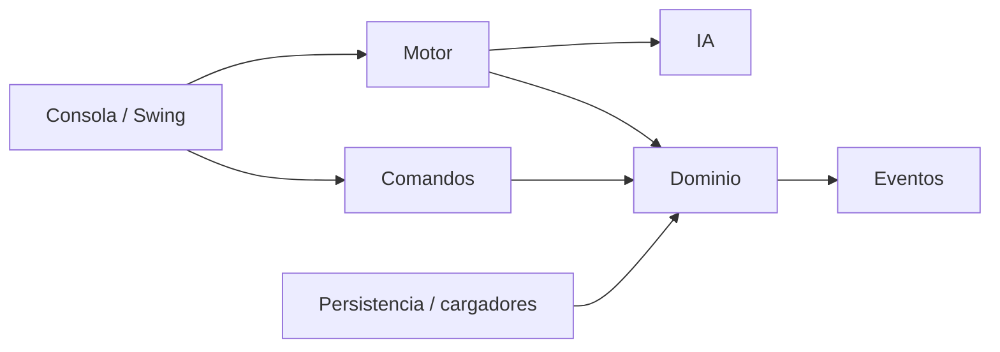

# Contrato técnico 10/10

La nota no depende de una valoración subjetiva: se sostiene mediante puertas
automatizadas y artefactos reproducibles.

| Dimensión | Evidencia obligatoria |
|---|---|
| Compatibilidad | Java 17, consola, Swing, TXT/JSON, savegame y replay |
| Correctitud | Suite JUnit 5 y pruebas deterministas por semilla |
| Cobertura | JaCoCo de líneas global igual o superior al 75 % |
| Arquitectura | ArchUnit impide dependencias dominio/motor → GUI/Swing |
| Tamaño | Checkstyle rechaza archivos Java de más de 1.700 líneas |
| Defectos | SpotBugs con esfuerzo máximo y cero defectos de severidad alta |
| Seguridad | OWASP CVSS 7+, CodeQL y política de divulgación privada |
| Inventario | SBOM CycloneDX JSON generado en cada `package` |
| Escala | 5.000 humanos contra 5.000 enemigos bajo heap limitado |
| Entrega | JAR ejecutable, Javadoc, cobertura, SBOM y capturas como artefactos CI |

## Fronteras verificadas



`NavegacionTactica`, `TurnoEnemigos` y `RegistroEstadoAliados` extraen búsqueda de
rutas, ejecución enemiga y estado operativo de la antigua fachada. Las mutaciones
de celdas, evacuaciones e inspecciones ya no copian colecciones completas.

## Revisión local

```bash
mvn clean verify
docker compose build juego gui javadoc javadoc-web
docker compose run --rm juego --help
```

El informe JaCoCo queda en `target/site/jacoco`, el Javadoc en
`target/reports/apidocs` y el inventario de componentes en `target/bom.json`.
